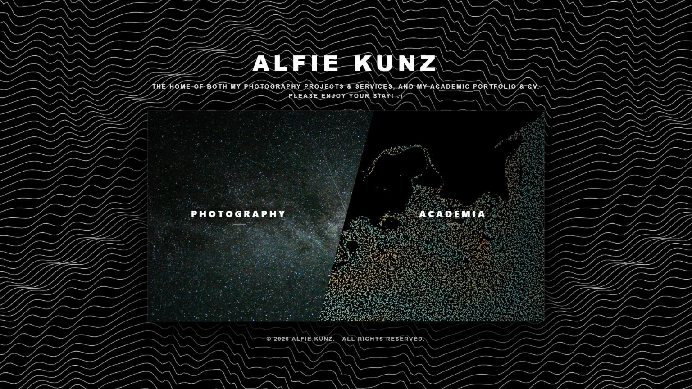
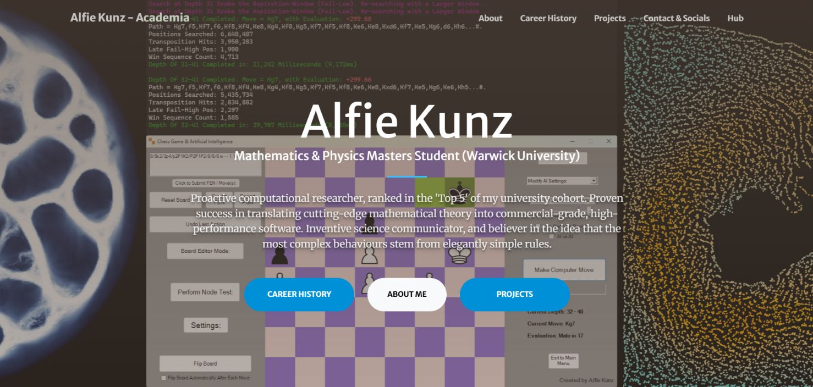
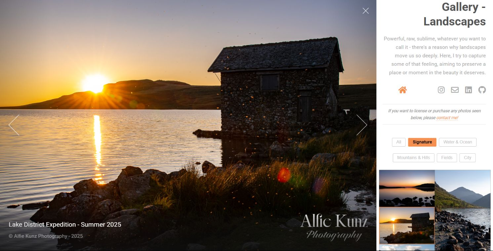
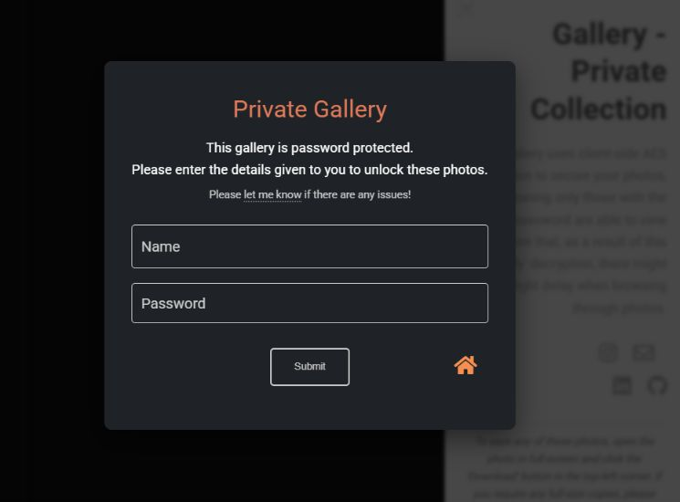

# Photography and Academic Web-based Portfolio


---

My first official website, intended for storing both my **academic profile**, projects and CV, along with my **photography portfolio** across a variety of categories. The academic profile contains a brief introduction, links to my projects with interactive demos, and a full descriptive list of my experience and skills. The photography portfolio captures all my photography to date, across a large variety of sub-genres, using an intuitive gallery system. This is also used to host private showcases, for event and coorporate work, with additional functionalities to accomodate for these clients.

This work is self-motivated and self-funded, and is written primarily in HTML, CSS (taking inspiration from the 'Start Bootstrap' styling), and JS.

<p align="center">
  
</p>

---

## Features and Highlights

### Main Page:  
✅ Client-sided background animation, using discretised superpositions of non-linear phase modulations.  
✅ Intuitive portals to both the photography and acaedmia sections.  

### Photography:  
✅ Intelligent, uncluttered spacing for mobile and desktop devices alike.  
✅ Unobtrusive hamburger, that adapts to the content underneath it.  
✅ Reactive windows for each gallery type, allowing the user to easily select which photos to view.  
✅ Friendly gallery system using tiles of photo thumbnails, which expand into full-screens upon clicking, equipped with gesture-controlled navigation.  
✅ Intelligent loading of sub-sections of images, using adaptive HTML injecting and JSON tags for each photo.  
✅ Private gallery feature, with each client's photos encrypted server-side using AES. Decryption and decompression handled on-device, effectively balancing data usage and speed of decryption.  
✅ Call for action, handled via a robust 'form submission' feature.  

### Academia:  
✅ Data-efficient, interactive background slideshow of my previous projects.  
✅ Clean description of my adacamic portfolio, and relevant experience, along with file-hosting of PDFs.  
✅ Full list of available projects, containing in-depth information and break-downs of key concepts, links to and hosting of interactive demos and media that showcase each project, and appropriate links to GitHub.

---

## Project Showcase

> **Project Demo:** You can see this project live directly through my [**Website**](https://www.alfiekunz.co.uk)!

Alternatively, one can download the source code, as instructed below, for full control.

<table align="center" width="100%">
  <tr>
    <td align="center" valign="middle" width="50%">
      <p align="center"><b>Main Academia Page</b></p>
      
    </td>
    <td align="center" valign="middle" width="50%">
      <p align="center"><b>Gallery Tiles in Photograpy Page</b></p>
      
    </td>
  </tr>
  <tr>
    <td align="center" valign="middle">
      <p align="center"><b>Example Gallery Showcase</b></p>
      
    </td>
    <td align="center" valign="middle">
      <p align="center"><b>Private Gallery</b></p>
      
    </td>
  </tr>
</table>

---

## Installation, and Folder Structure

### Required Software: None.

To install, simply clone this repository using the following terminal prompts.
```bash
git clone https://github.com/AlfieKunz/Website-Portfolio
cd Website-Portfolio
```


Feel free to also fork this repository, open an issue, or submit pull requests. All contributions welcome! :)  
To better navigate this project, please see below for the related folder structure.

```
Website-Portfolio
├─ academia                                      // Academic section
│  ├─ assets                                     // Images of each project, Webmanifest info for academia
│  ├─ career.html                                // Experiece & Education section
│  ├─ css                                        // Bootstrap styling (blue theme for academia)
│  ├─ index.html                                 // Main page for academia: slideshow, deferring to other sections
│  ├─ js                                         // Scripts for academia slideshow, hamburger, and forms
│  └─ projects.html                              // Projects showcases and information
├─ assets                                        // CSS styling, favicon and thumbnails for main page
├─ index.html                                    // Main page HTML; scripting for background animation
├─ photography                                   // Photography section
│  ├─ assets                                     // Fvicons, images for main photography page (hero + gallery)
│  ├─ css                                        // Bootstrap styling (orange theme for photography)
│  ├─ gallery                                    // Gallery (changes for each photo type via "category=?")
│  │  ├─ assets                                  //
│  │  │  ├─ css                                  // CSS of gallery
│  │  │  └─ js                                   //
│  │  │     ├─ gallery.js                        // Script for adapting the gallery for each photo type (and loading the required photos), tag handling, decrypting for private gallery
│  │  │     └─ main.js                           // Script for displaying & interacting with gallery slides
│  │  ├─ data                                    // JSON data for each photo category
│  │  ├─ images                                  // Fulls and Thumbs for each photo category
│  │  │  └─ private                              // All encrypted server-side using the .enc file type
│  │  ├─ index.html                              // Main page for Gallery: displaying and interacting with photos
│  │  ├─ Instructions.txt                        // Details on how to encrypt photos for the Private gallery, file formats, etc
│  │  └─ programs                                // Python programs for handing new photos, thumb & JSON creation, encrypting, etc
│  ├─ index.html                                 // Main page for photography: displaying galleries, hamburger, forms
│  └─ js                                         // Scripts for photography gallery hovering, hamburger, and forms
└─ shared                                        // All other files for personal use, not related to website

```

---

## References

Original Website Templates:
- Lens (HTML5 UP!)
- Creative (Start Bootstrap)
- Personal (Start Bootstrap)