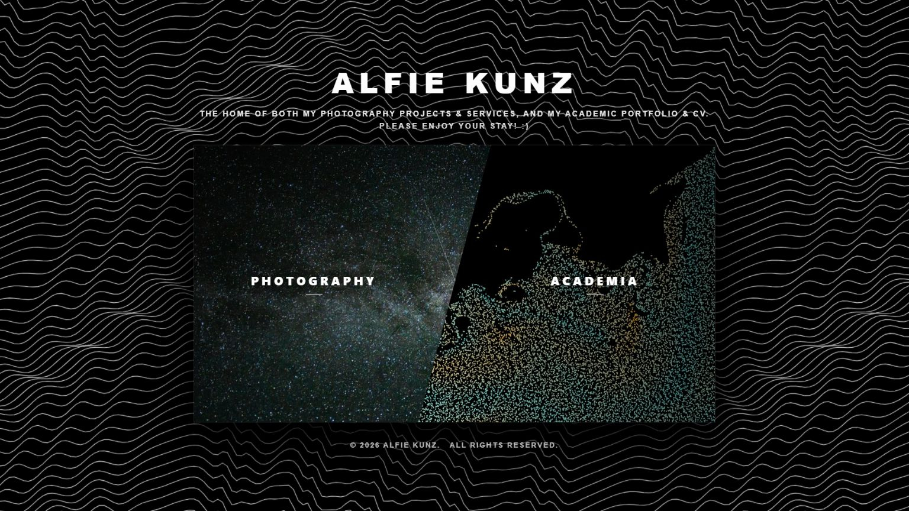
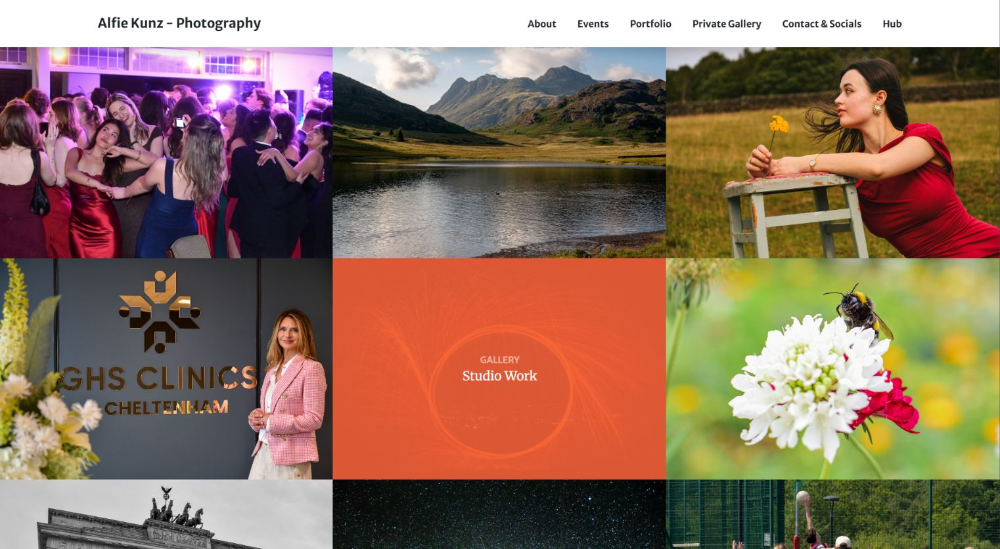
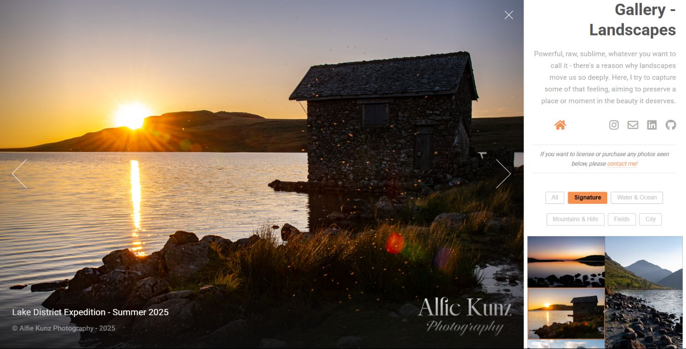
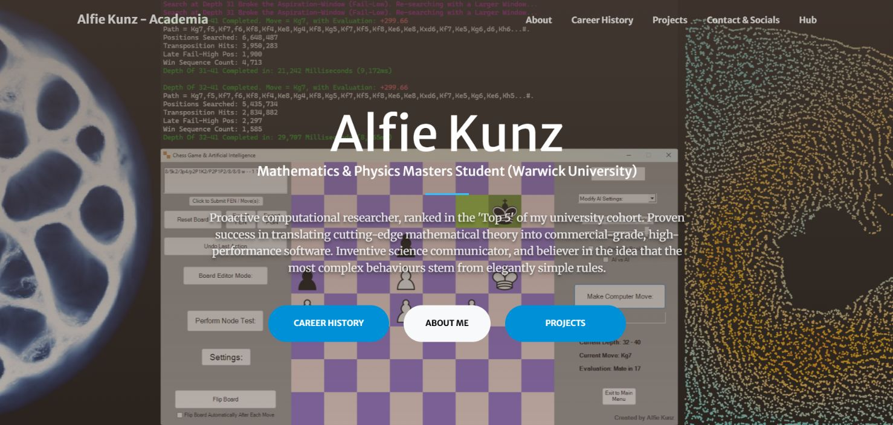

# Photography and Academic Web-based Portfolio


---

My first official website, intended for storing my **academic profile**, projects and CV, along with my **photography portfolio** across a variety of categories. The academic profile contains a brief introduction, links to my projects with interactive demos, and a full descriptive list of my experience and skills. The photography portfolio captures all my photography to date, across a large variety of sub-genres, using an intuitive gallery system. This is also used to host private showcases, for event and corporate work, with additional functionalities to accommodate for these clients.

This work is self-motivated and self-funded, and is written primarily in HTML, CSS (taking inspiration from the 'Start Bootstrap' styling), and JS.

<p align="center">
  
</p>

---

## Features and Highlights

### Main Page:  
✅ Intuitive portals to both the photography and academia sections, with smooth hovering animations.  
✅ Client-side background animation, using discretised superpositions of non-linear phase modulations.  
✅ Intelligent and performance-mindful page re-organisation to accommodate for a variety of screen sizes & shapes.  

### Photography:  
✅ Spacious and friendly visuals that introduce the user to my photography style and features.  
✅ Unobtrusive hamburger, that adapts to the content underneath it: able to quickly jump across sections, or to the top of the page by clicking my name.  
✅ Reactive windows for each gallery type, allowing the user to easily determine which photos are in each gallery.  
✅ Friendly gallery system using tiles of compressed photo thumbnails, nested under a gallery title and description for each type of photo. Created as a blank template that is intelligently populated based on the photos and data in each sub-folder (handled via JSON data).  
✅ Ability to view full-sized photos upon clicking - appearing alongside the gallery tiles for desktop (but with buttons to view only the photo).  
✅ Full-sized photos equipped with gesture and button controlled navigation (depending on the device).  
✅ Clean lazy-loading for gallery images, showing thumbnails and full-sized images only when requested.  
✅ Intelligent loading of "photo tag" sub-sections of images, using adaptive HTML injection and JSON tags for each photo.  
✅ Private gallery feature, with each client's photos encrypted server-side using AES. Decryption and decompression handled on-device by entering a username and password (with robust handling of incorrect data, and a visual guide as to the nature of the bad request), effectively balancing data usage and speed of decryption. See the below folder structure for the accompanying Python encryption program.  
✅ Call to action and contact page, handled via a robust 'form submission' feature with variable message size handling.  
✅ Patient redirecting links at the bottom of the page, for social media, and the academic site.  
✅ Intelligent page re-organisation to accommodate for a variety of screen sizes & shapes.  

### Academia:  
✅ Data-efficient, interactive background slideshow of my previous projects, with a Pause/Play button to control.  
✅ Unobtrusive hamburger, that adapts to the content underneath it: able to quickly jump across sections, or to the top of the page by clicking my name.  
✅ Clean description of my academic profile, expertise and core information, along with easy links to my CV (hosted server-side).  
✅ Full career history, containing bite-sized bubbles for each education, experience, languages, and core competencies category (along with colour gradients that evolve as the user scrolls).  
✅ In-depth career information via a floating project overview panel. Contains easy links to related projects and experience via a small floating gallery system.  
✅ Full list of my available projects, with bubbles containing key project info & associations, eye-drawing hero images, and separation into sub-project windows.  
✅ In-depth project information via a floating project overview panel, that fetches, parses and integrates live GitHub repo READMEs into my website colour scheme. Hosts related PDFs, interactive demos, and links to external media and GitHub repositories.  
✅ Call to action and contact page, handled via a robust 'form submission' feature with variable message size handling.  
✅ Patient redirecting links at the bottom of the page, for social media, and the academic site.  
✅ Intelligent page re-organisation and information blending to accommodate for a variety of screen sizes & shapes, ensuring clean displaying of elements whilst losing no relevant information.  

---

## Project Showcase

> **Project Demo:** You can see this project live directly through my [**Website**](https://www.alfiekunz.co.uk)!

Alternatively, one can download the source code, as instructed below, for full control.

<table align="center" width="100%">
  <tr>
    <td align="center" valign="middle">
      <p align="center"><b>Gallery Tiles in Photography Page</b></p>
      
    </td>
    <td align="center" valign="middle">
      <p align="center"><b>Example Gallery Showcase</b></p>
      
    </td>
  </tr>
  <tr>
    <td align="center" valign="middle" width="60%">
      <p align="center"><b>Main Academia Page</b></p>
      
    </td>
    <td align="center" valign="middle" width="40%">
      <p align="center"><b>Example Project Showcase</b></p>
      
    </td>
  </tr>
</table>

---

## Installation and Folder Structure

### Required Software: None.

To install, simply clone this repository using the following terminal prompts.
```bash
git clone https://github.com/AlfieKunz/Website-Portfolio
cd Website-Portfolio
```


Feel free to also fork this repository, open an issue, or submit pull requests. All contributions welcome! :)  
To better navigate this project, please see below for the related folder structure.

```
Website-Portfolio
├─ academia               // Academic section
│  ├─ assets              // Images of each project, Webmanifest info for academia
│  ├─ career              //
|  │  └─ index.html       // Experience & Education section, experience panels with related projects
│  ├─ css                 // Bootstrap styling (blue theme for academia)
│  ├─ index.html          // Main page for academia: slideshow, deferring to other sections
│  ├─ js                  // Scripts for academia slideshow, hamburger, and forms
│  └─ projects            //
|     └─ index.html       // Projects showcases and information, GitHub README integration
├─ assets                 // CSS styling, favicon and thumbnails for main page
├─ index.html             // Main page HTML; scripting for background animation
├─ photography            // Photography section
│  ├─ assets              // Favicons, images for main photography page (hero + gallery)
│  ├─ css                 // Bootstrap styling (orange theme for photography)
│  ├─ gallery             // Gallery (changes for each photo type via "category=?")
│  │  ├─ assets           //
│  │  │  ├─ css           // CSS of gallery
│  │  │  └─ js            //
│  │  │     ├─ gallery.js // Script for adapting the gallery for each photo type (and loading the required photos), tag handling, decrypting for private gallery
│  │  │     └─ main.js    // Script for displaying & interacting with gallery slides
│  │  ├─ data             // JSON data for each photo category
│  │  ├─ images           // Fulls and Thumbs for each photo category
│  │  │  └─ private       // All encrypted server-side using the .enc file type
│  │  ├─ index.html       // Main page for Gallery: displaying and interacting with photos
│  │  ├─ Instructions.txt // Details on how to encrypt photos for the Private gallery, file formats, etc
│  │  └─ programs         // Python programs for handling new photos, thumb & JSON creation, encrypting, etc
│  ├─ index.html          // Main page for photography: displaying galleries, hamburger, forms
│  └─ js                  // Scripts for photography gallery hovering, hamburger, and forms
└─ shared                 // All other files for personal use, not related to website
```

---

## References

Original Website Templates:
- Lens (HTML5 UP!)
- Creative (Start Bootstrap)
- Personal (Start Bootstrap)